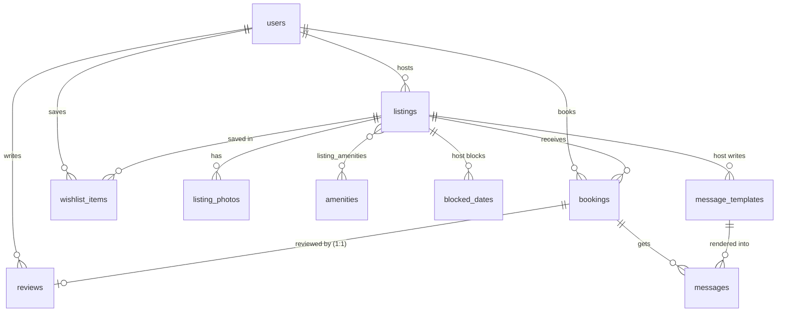

# Airbnb Clone

A full-stack Airbnb clone for the Indian market (₹ INR). Guests can search homes, view listing details, book stays with live availability, and manage their trips. Hosts can create and manage listings, control their calendar, set pricing rules and schedule automated messages to guests.

- **Live demo:** https://airbnb-clone-beta-inky-92.vercel.app
- **API docs (Swagger):** https://backend-production-2fe98.up.railway.app/docs
- **Source:** https://github.com/speghetimafia/airbnb-clone

## Tech stack

| Layer | Choice |
|---|---|
| Frontend | Next.js 16 (App Router), React 19, TypeScript, Tailwind CSS 4 |
| UI libraries | react-day-picker (date ranges), react-leaflet + OpenStreetMap (maps), sonner (toasts), lucide-react (icons) |
| Backend | Python 3.12, FastAPI, SQLAlchemy 2, Pydantic 2 |
| Database | SQLite (foreign keys on, cascades, CHECK constraints) |
| Tests | pytest + FastAPI TestClient |
| Hosting | Vercel (frontend), Railway with a persistent volume (backend + SQLite) |

## Features

**Guests**
- Explore grid with a photo carousel on each card, ratings, a "Guest favourite" badge and wishlist hearts
- Where / When / Who search bar with destination suggestions, a two-month date-range picker and a guest counter
- Category icon row, plus a filters modal (price range, rooms and beds, property type, amenities)
- Infinite scroll, and a map view with price pins (hovering a card highlights its pin)
- Listing page:
  - 5-photo gallery and a full-screen photo modal
  - Amenities, host card, reviews with a rating breakdown, map, house rules
  - Availability calendar with booked nights greyed out
- Sticky booking card with live price quote: nightly × nights, weekend pricing, weekly/monthly discounts, cleaning fee, service fee
- Checkout page ("Confirm and pay") with a mocked card form, then a confirmation and a toast
- Trips page (upcoming, past, cancelled):
  - Cancel a trip, which frees the dates immediately
  - Leave a review after checkout
  - A per-trip inbox with the host's automated messages
- Wishlists page

**Hosts**
- Dashboard with reservations (upcoming, currently hosting, past, cancelled), this month's payouts, and a listings table
- Full listing create, edit and delete:
  - Photos by upload or URL, with a cover photo
  - Click-to-place map pin
  - Amenities
  - Pricing rules
  - Availability rules
- **Calendar control:** block nights for maintenance or personal use (shown hatched); reservations are shown in pink
- **Pricing rules:** base price, weekend (Fri/Sat) price, cleaning fee, weekly (7+ nights) and monthly (28+ nights) discounts, min/max nights, check-in/out times
- **Scheduled messages:** templates such as Wi-Fi password, directions and check-in instructions, using placeholders like `{guest_name}` and `{maps_link}`. Each one is sent on confirmation, the day before check-in, or on checkout day. A live preview shows the filled-in text.

**Placeholders ("Coming soon")**: guest–host chat replies, identity verification, Experiences and Services tabs, and real payments.

## Running locally

Prerequisites: Python 3.12+ and Node 20+.

```bash
# Backend: http://localhost:8000 (Swagger at /docs)
cd backend
python3 -m venv .venv && source .venv/bin/activate
pip install -r requirements.txt
python -m app.seed            # creates data/airbnb.db with demo data (re-run to reset)
uvicorn app.main:app --reload --port 8000
```

```bash
# Frontend: http://localhost:3000
cd frontend
npm install
cp .env.example .env.local    # NEXT_PUBLIC_API_URL=http://localhost:8000
npm run dev
```

```bash
# Tests
cd backend && pytest -q
```

**Demo accounts:** log in through the menu and pick any user. *Ananya Sharma* and *Rohan Mehta* are Superhosts with listings. *Arjun Kapoor* is a guest with an upcoming trip tomorrow (so the "day before check-in" message is visible), a past stay waiting for a review, and a cancelled trip.

## Architecture

```
frontend/ (Next.js, client-rendered pages)             backend/ (FastAPI)
  app/            pages: /, /rooms/[id], /book/[id],     app/main.py      app, CORS, routers, /uploads static
                  /trips, /wishlists, /hosting/...       app/routers/     listings · bookings · host · users
  components/     Header+SearchBar, ListingCard,         app/rules.py     pricing, availability, validation,
                  BookingCard, RangeCalendar, MapView,                    message rendering (pure, unit-tested)
                  FiltersModal, ListingForm, Modal       app/models.py    SQLAlchemy schema
  lib/api.ts      fetch wrapper (adds X-User-Id)         app/schemas.py   Pydantic request/response models
  lib/user.tsx    session + wishlist context             app/deps.py      DB session, mocked auth, ownership checks
  lib/useApi.ts   GET + loading/error hook               app/seed.py      demo data
```

**Key decisions**
- **The backend is the only place prices and availability are calculated.** The listing page, search cards (when dates are set) and checkout all show numbers from `GET /listings/{id}/quote`, and `POST /bookings` recalculates them before saving. The price shown can never differ from the price charged.
- **Bookings store a copy of the price.** Each booking saves nightly total, discount, fees and total, so a later price change by the host never alters past bookings.
- **Date ranges are half-open `[check_in, check_out)`.** Two stays overlap when `a.start < b.end AND a.end > b.start`. The checkout day is free for the next check-in, so back-to-back bookings work. The same SQL `EXISTS` clause is used by search, quotes, bookings and host blocks.
- **Preventing double-booking:** the availability check and the insert run under one process-wide lock, so two concurrent requests can't both pass the check. This holds for a single server process; running more than one worker would need a database-level lock (e.g. `BEGIN IMMEDIATE`).
- **Messages need no background job.** On booking, each template is filled in and stored with a `send_at` time. The inbox only returns messages whose `send_at` has passed. A "day before check-in" message for a last-minute booking is sent right after the confirmation instead.
- **Mocked auth:** the frontend stores the chosen user id and sends `X-User-Id`. All authorization (owner-only edits, guest-only reviews, guest-or-host cancellation) is enforced on the server in `deps.py` and the routers. A user counts as a host once they own a listing.
- **Search state lives in the URL** (`/?location=Goa&check_in=…&category=…`), so searches can be shared and the back button works.

## Database schema



| Table | Columns (key ones) | Constraints |
|---|---|---|
| `users` | name, email, avatar_url, bio, is_superhost, joined_at | email unique |
| `listings` | host_id, title, description, property_type, category, city, state, address, lat, lng, max_guests, bedrooms, beds, baths, base_price, weekend_price, cleaning_fee, weekly_discount_pct, monthly_discount_pct, min_nights, max_nights, check_in_time, check_out_time | price > 0, min ≤ max nights, discounts 0–90, index on city |
| `listing_photos` | listing_id, url, position | cascade delete |
| `amenities`, `listing_amenities` | name, icon / (listing_id, amenity_id) | composite PK |
| `bookings` | listing_id, guest_id, check_in, check_out, guests, nights, nightly_total, discount, cleaning_fee, service_fee, total, status | check_out > check_in, status ∈ {confirmed, cancelled}, index (listing_id, check_in, check_out) |
| `blocked_dates` | listing_id, start_date, end_date, note | end > start |
| `reviews` | booking_id, listing_id, author_id, rating, comment | booking_id unique (one review per stay), rating 1–5 |
| `wishlist_items` | user_id, listing_id | composite PK, so it's idempotent |
| `message_templates` | listing_id, title, body, trigger | trigger ∈ {on_confirm, day_before_checkin, on_checkout} |
| `messages` | booking_id, template_id, title, body, send_at | template_id SET NULL on delete |

Ratings are computed from `reviews` (AVG/COUNT subquery) rather than stored on the listing, so they can never drift out of date.

## API overview

All routes are under `/api`. Interactive docs are at `/docs`. Requests that need a user send `X-User-Id`.

| Method & path | Purpose |
|---|---|
| `GET /listings` | Search: `location, check_in, check_out, guests, category, property_type, min_price, max_price, bedrooms, beds, amenities, page, page_size` → `{items, total, page, pages}` |
| `GET /listings/{id}` | Detail with host, photos, amenities, rating |
| `GET /listings/{id}/availability` | Booked + blocked ranges from today |
| `GET /listings/{id}/quote?check_in&check_out&guests` | Validated price breakdown (422 rule violation, 409 unavailable) |
| `GET /listings/{id}/reviews` | Reviews, newest first |
| `POST /listings`, `PUT /listings/{id}`, `DELETE /listings/{id}` | Host CRUD (owner only; delete blocked while upcoming reservations exist) |
| `GET/POST /listings/{id}/blocks`, `DELETE /blocks/{id}` | Host calendar blocks |
| `GET/POST /listings/{id}/templates`, `PUT/DELETE /templates/{id}` | Scheduled message templates |
| `POST /bookings` | Book (validates dates, min/max nights, guests, own-listing, overlap) |
| `GET /bookings/me` | My trips |
| `POST /bookings/{id}/cancel` | Guest or host cancels before check-in |
| `GET /bookings/{id}/messages` | Messages that are due |
| `POST /bookings/{id}/review` | Review after checkout, once |
| `GET /host/listings`, `GET /host/bookings` | Host dashboard data |
| `GET /wishlist`, `GET /wishlist/ids`, `POST/DELETE /wishlist/{listing_id}` | Wishlist |
| `GET /users`, `GET /me`, `GET /amenities` | Login switcher, session, amenity list |
| `POST /uploads` | Image upload (JPEG/PNG/WebP, ≤ 5 MB) → `{url}` |

## Deployment

**Backend on Railway**
1. Create a project with a service whose root is `backend/` (via the dashboard, or `railway up ./backend --path-as-root`). `railpack.json` sets the start command, `python -m app.main`, which seeds an empty database and then serves on `$PORT`.
2. Add a volume mounted at `/data`, and set the variables `DATA_DIR=/data` and `CORS_ORIGINS=https://<your-vercel-app>.vercel.app`.
3. Generate a public domain.

**Frontend on Vercel**
1. Import the repo and set the root directory to `frontend`.
2. Set `NEXT_PUBLIC_API_URL=https://<railway-domain>`.

## Assumptions and simplifications

- Payments are mocked. The card form only checks the format and nothing is charged. Cancelling before check-in gives a full refund.
- Auth is mocked with a user switcher, but every permission is still checked on the server.
- Prices are whole rupees. The service fee is a flat 14% of (nights − discount + cleaning). Taxes and GST are not modelled.
- Weekend nights are Friday and Saturday. Only one discount applies: the monthly discount for 28+ nights if the host set one, otherwise the weekly discount for 7+ nights.
- Search location is a case-insensitive match on city, state or title. There is no geocoding.
- Uploaded images go on the backend's volume rather than cloud storage. Seed photos come from Unsplash and avatars from pravatar.cc.
- Seed dates are relative to the day the database was seeded, so the demo always has upcoming and past trips.
- Editing a template only affects future bookings, because messages are filled in when the booking is made.
